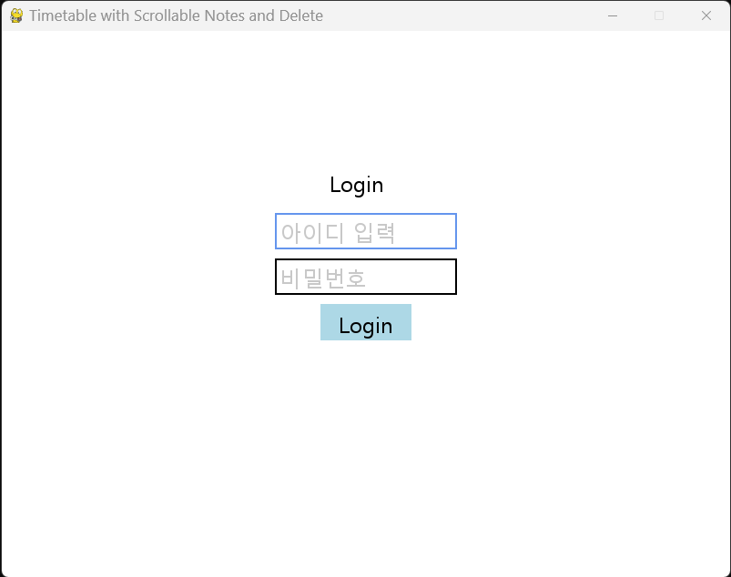
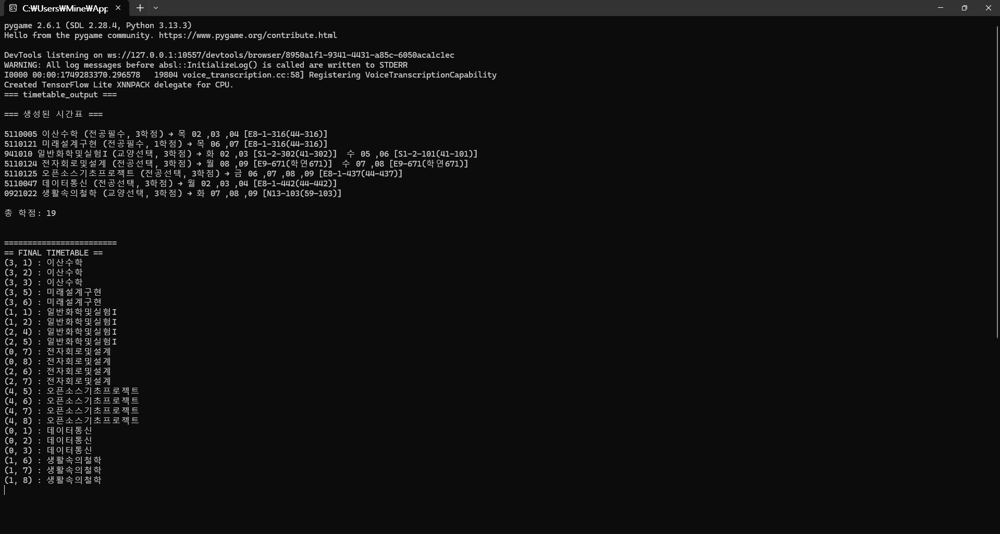
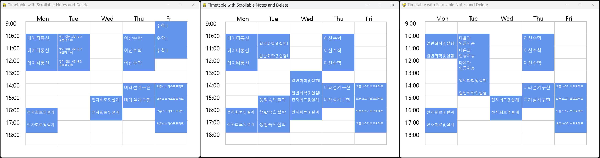

# 학적 정보 기반 자동 시간표 작성 알고리즘
<hr style="height:3px; background-color:black; border:none;" />

충북대학교 오픈소스기초프로젝트 💥좌충우돌💥팀에서 진행하는 자동 시간표 작성 알고리즘에 대한 소개 문서입니다.

## 💻프로젝트 소개
이 프로그램은 매 학기 시간표를 짜는 번거로움을 덜기 위해 개발되었습니다. 입력받은 로그인 정보를 토대로 학생의 이수 현황과 개설 과목 정보를 바탕으로 자동으로 시간표를 구성해주며, 이를 통해 수강 계획에 드는 시간을 줄이고, 보다 효율적인 학사 운영이 가능하도록 돕습니다. 특히 수강 신청을 앞둔 학생이나 졸업 요건을 관리하는 이들에게 유용합니다.
### 이 알고리즘에서는
- GUI 팝업 창이 열려서 로그인 정보를 입력받습니다
- 입력받은 학번과 비밀번호를 이용해서 개신누리 사이트에 자동으로 로그인, 학적 정보를 스캔합니다.
- 수집된 사용자의 학점이수현황과 학년정보, 기이수한 과목들 등의 정보들을 토대로 임의의 시간표를 작성합니다.

## 📅개발 기간
2025.04.03(목) ~ 2025.06.07(토)

## 🧑‍💻개발자 소개
- 박태훈 @Andrew4521 / Email: pthoon0605@naver.com
- 박호상@qtkqhg / Email: bakhosang@gmail.com
- 이규원@Leegyuone / Email: pakachu1994@chungbuk.ac.kr
- 정민준 @gisook / Email: mj5037885@gmail.com

## 💾 요구 플러그인 및 브라우저 설치법

```
우선 Chrome Brower 및 Python을 최신 버전으로 설치

이후 PowerShell 을 열어서 아래 명령어들을 실행

- pip install pyautogui
- pip install selenium
- pip install webdriver-manager
```
*Chrome이 없다면 webdriver-manager가 드라이버 다운로드에 실패할 수 있음.

[Python 공식 다운로드 페이지](https://www.python.org/downloads/)
설치 중에는 “Add Python to PATH” 옵션을 반드시 체크해야 함.

## ✏️ 실행 방법
1. Main.py 실행
2. 팝업창으로 나온 GUI에 학번과 비밀번호 입력 후 Login 버튼 클릭
3. 일정 시간 대기 시 콘솔 창과 GUI로 시간표 제작 결과가 출력됨

## 🎬 실행 화면
<h4>🔹 첫 실행 시 나오는 GUI 팝업</h4>


<h4>🔹 결과 화면</h4>


<h4>🔹 전공필수 제외 나머지 과목은 랜덤 배정</h4>


## 📁 의존성

```데이터 수집에 필요한 플러그인
PyAutoGUI                    0.9.54,
selenium                     4.32.0,
webdriver-manager            4.0.2,
chrome                       136.0.7103.49
```

## 📋 LICENSE
```
Copyright (c) 2025 <저작권 소유자>

Permission is hereby granted, free of charge, to any person obtaining a copy
of this software and associated documentation files (the "Software"), to deal
in the Software without restriction, including without limitation the rights
to use, copy, modify, merge, publish, distribute, sublicense, and/or sell
copies of the Software, and to permit persons to whom the Software is
furnished to do so, subject to the following conditions:

The above copyright notice and this permission notice shall be included in all
copies or substantial portions of the Software.

THE SOFTWARE IS PROVIDED "AS IS", WITHOUT WARRANTY OF ANY KIND, EXPRESS OR
IMPLIED, INCLUDING BUT NOT LIMITED TO THE WARRANTIES OF MERCHANTABILITY,
FITNESS FOR A PARTICULAR PURPOSE AND NONINFRINGEMENT. IN NO EVENT SHALL THE
AUTHORS OR COPYRIGHT HOLDERS BE LIABLE FOR ANY CLAIM, DAMAGES OR OTHER
LIABILITY, WHETHER IN AN ACTION OF CONTRACT, TORT OR OTHERWISE, ARISING FROM,
OUT OF OR IN CONNECTION WITH THE SOFTWARE OR THE USE OR OTHER DEALINGS IN THE
SOFTWARE.
```
